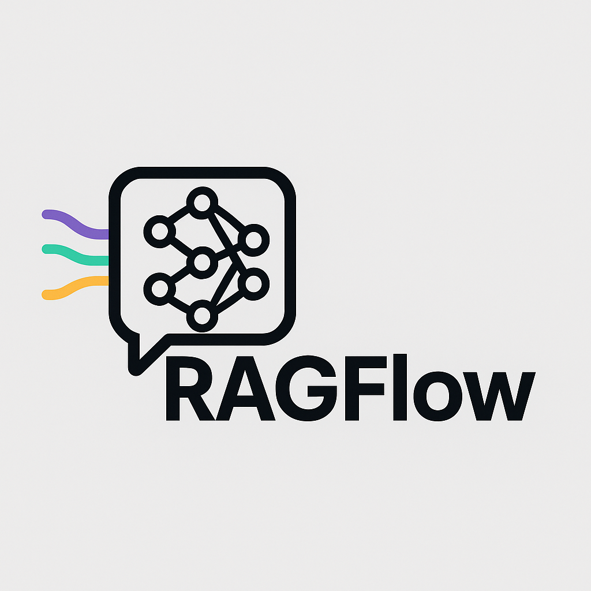
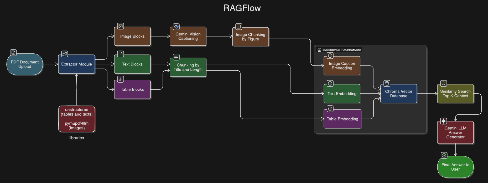

<div align="center">
  
  <p><em>A Voice-Driven Multimodal RAG System for Intelligent Document Q&A</em></p>

</div>

---

## 🚀 About the Project

**RAGFlow** is an intelligent, multimodal RAG (Retrieval-Augmented Generation) system that enables users to:

- Upload a document (PDF)
- Extract and analyze **text**, **tables**, and **images**
- Ask questions through **voice input**
- Get highly accurate answers from an LLM, grounded only in the uploaded content

Whether your document has visual diagrams, structured tables, or rich text, **RAGFlow** understands and retrieves the most relevant parts before answering via **Gemini or Groq-backed LLMs**.

---

## 🧩 Core Features

✅ PDF Ingestion with image, table, and text extraction  
✅ Captioning of figures using **Gemini Vision**/**Groq Vision**(Groq models accessible from 'rag_whole.py')
✅ Chunking via title-aware strategy and figure metadata  
✅ Embedding using **Cohere** models  
✅ Vector storage in **ChromaDB**  
✅ Voice input powered by **AssemblyAI**  
✅ Answer generation using **Gemini 2.5** or **Groq LLaMA 4**  
✅ Streamlit & RESTful API with modular backend  

---

## 🏗️ Architecture Diagram

> Here's how information flows through the system:
> 
<div align="center">
  
</div>
<br>

1. **PDF Upload**
   User uploads a PDF which is stored locally in the `uploads/` directory for processing.

2. **Multimodal Extraction**
   Text and tables are extracted using `unstructured`, and images using `pymupdf4llm`.

3. **Image Captioning**
   Extracted images are passed to Gemini Vision/Groq models (Groq models can be used from 'rag_whole.py' to generate detailed captions.

4. **Chunking**
   Text and tables are chunked by titles, image captions are chunked post-captioning by figure metadata.

5. **Embeddings**
   Each chunk is embedded separately using Cohere’s `embed-english-v3.0` embedding model.

6. **Vector Storage (ChromaDB)**
   All embeddings with metadata are stored in ChromaDB for fast document-specific retrieval.

7. **Voice Input**
   User asks questions via microphone, transcribed in real time using AssemblyAI.

8. **Context Retrieval**
   Transcribed query is used to fetch top-K most relevant chunks filtered by document ID.

9. **Answer Generation**
   Retrieved chunks and the query are passed to Gemini 2.5 or Groq’s LLaMA-4 for grounded answering.

10. **Response Delivery**
    The final answer, backed by retrieved document context, is returned to the user via UI or API.


---

## 🗃️ Project Structure

```
RAGFlow/
├── frontend/            # has the frontend code 
├── api/                 # FastAPI route logic
│   ├── upload.py        # /upload endpoint
│   └── transcribe.py    # /transcribe endpoint
├── rag/                 # RAG modules (chunking, retriever, constants)
│   ├── captioning.py
│   ├── extractors.py
│   ├── rag_pipeline.py
│   ├── retriever_setup.py
│   └── rag_constants.py
├── utils/               # Utility scripts (e.g., Gemini captioning)
│   └── gemini.py
├── uploads/             # Uploaded PDFs
├── figures/             # Extracted images
├── chroma_store/        # ChromaDB storage
├── rag_whole.py         # Full pipeline using Groq + image captioning
├── main.py              # FastAPI entrypoint
├── app.py               # Streamlit app (Main UI)
├── processed.json       # Tracks already-processed PDFs
├── architecture.png     # System architecture diagram
├── requirements.txt     # Dependencies
└── README.md
```

## ⚙️ Setup Instructions

### 1. Clone the repo

```bash
git clone https://github.com/kaushik-yadav/RAGFlow.git
cd RAGFlow
```

### 2. Create virtual environment & install

```bash
python -m venv venv
source venv/bin/activate  # or .\venv\Scripts\activate
pip install -r requirements.txt
```

### 3. Configure `.env`

```env
GEMINI_IMAGE_API_KEY=your_gemini_api_key
GROQ_API_KEY=your_groq_key
COHERE_API_KEY=your_cohere_key
ASSEMBLYAI_API_KEY=your_assembly_key
```

### 4. Run the FastAPI backend

```bash
uvicorn main:app --reload
```

### 5. Run Streamlit app

```bash
streamlit run app.py
```

---

## 🔧 Technologies Used

| Component        | Tool / Library      |
| ---------------- | ------------------- |
| Backend API      | FastAPI             |
| Frontend         | Streamlit           |
| RAG Engine       | LangChain           |
| Vector DB        | Chroma              |
| Embeddings       | Cohere              |
| Vision Models    | Gemini Vision, Groq |
| Image Extraction | pymupdf4llm         |
| Table/Text Parse | unstructured        |
| STT              | AssemblyAI          |
| Answering LLMs   | Gemini 2.5 / LLaMA4 |

---

* A `LICENSE` file
* GitHub badges (build, stars, etc.)
* Deployment instructions (e.g. Render, Vercel, HuggingFace Spaces)

I'll add it for you.
